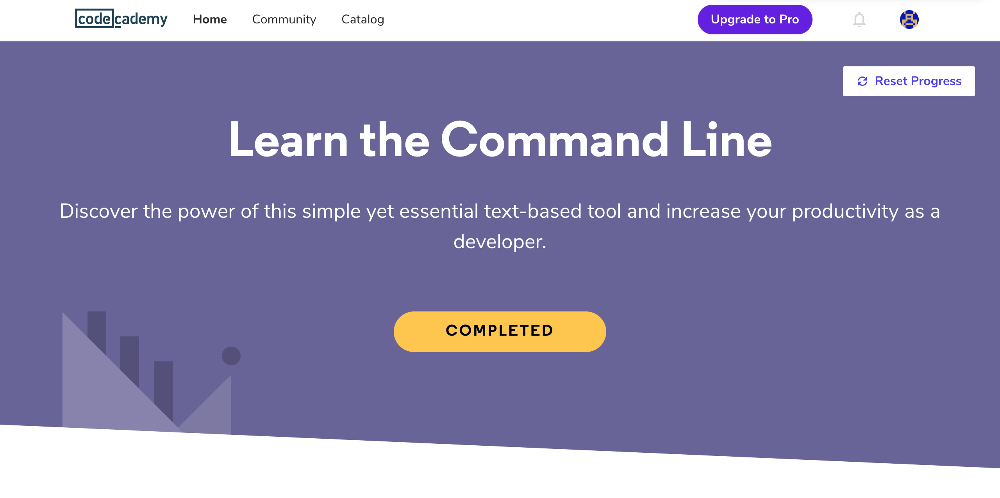
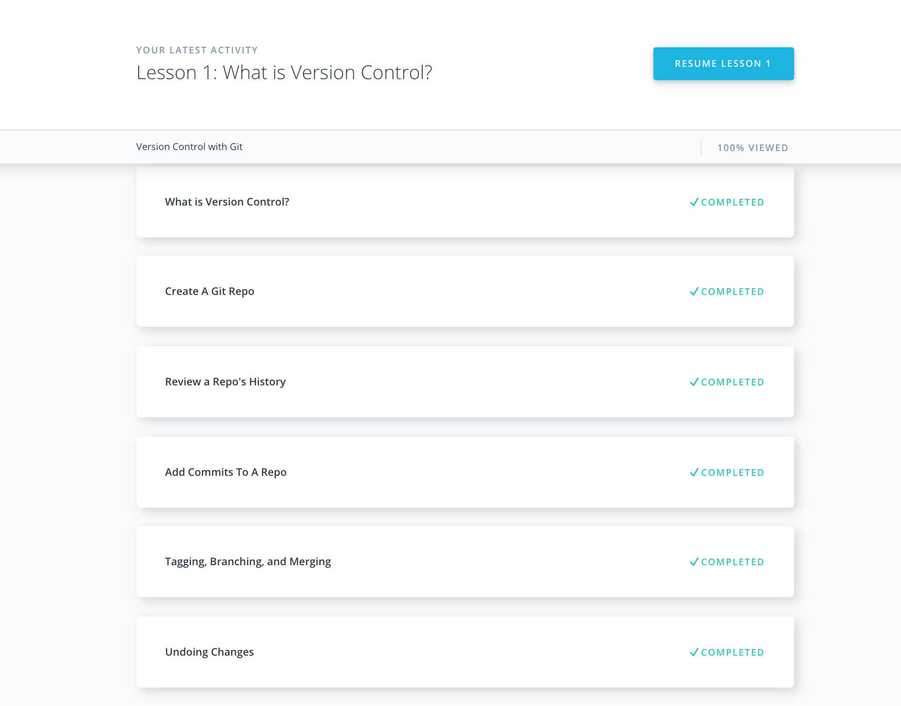
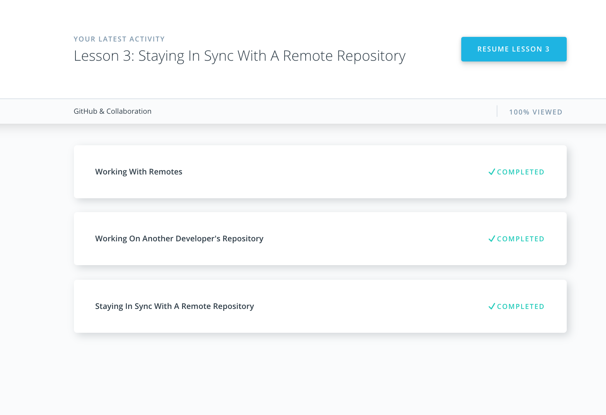
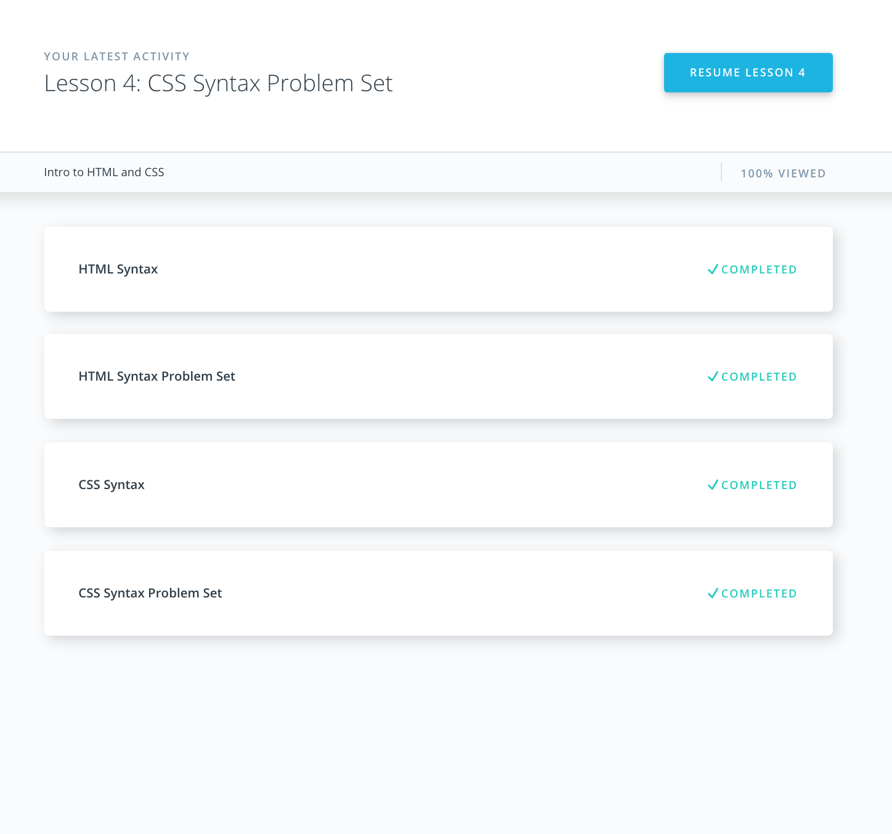
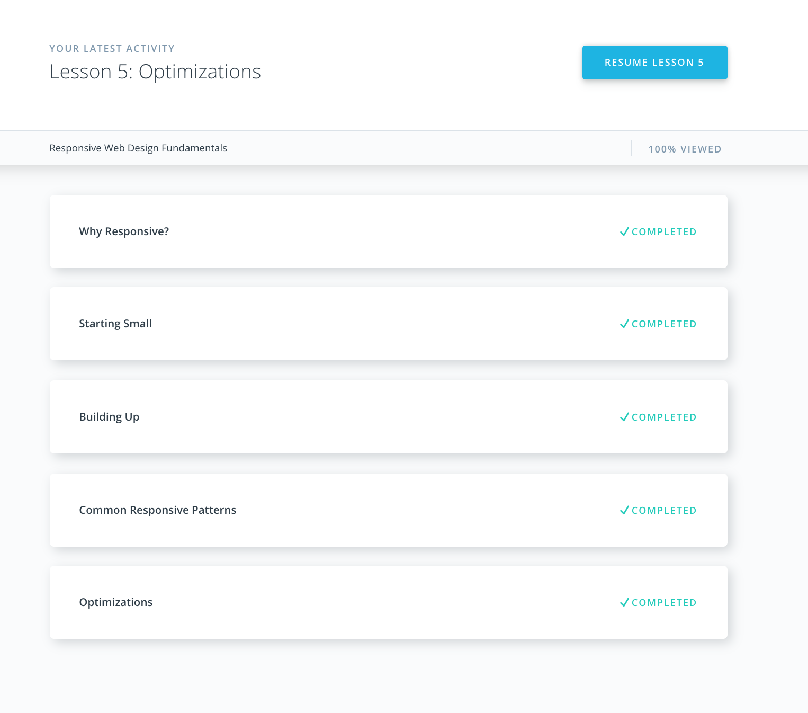
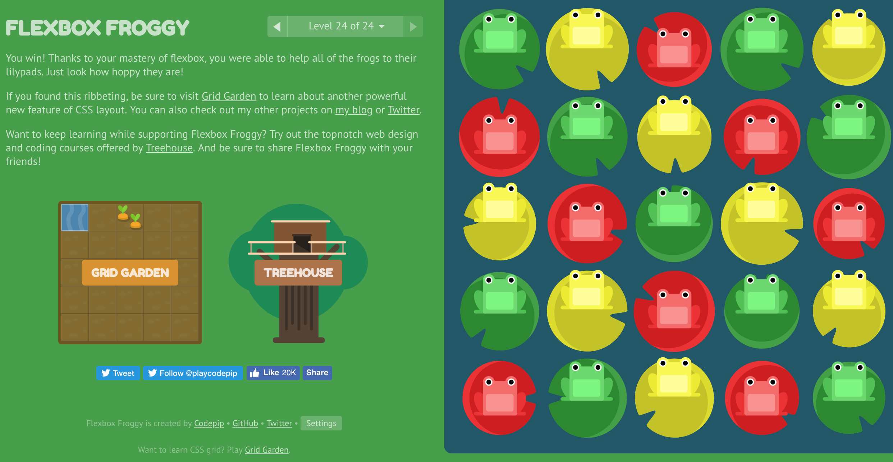

# Kottans frontend course 2019

## Task 0: Git Basics

I liked a lot Udemy git course. Especially materials about pull-request and branching was useful for me.
And, here is my answers to three questions, which was listed in general requirements:

- Materials about about conflicts, branches and merging was new for me.

- I was suprised, that is the thing like staging area exists in git. Also, the thing about octopus was surprising me too.

- I totally will use all the things, that i learned during the course. But right now, i will use knowledge about pull-requests.

## Task 1: Linux CLI, and HTTP

- I liked the practice with the Bash
- I learned a lot about the http protocol 
- Right now, I will use 'get' requests to get the content of the pages.

## Task 2: Git Collaboration

- I learned how it`s to make squash.
- I was surprised how easy it is to participate in the open source.
- I will always do git pull before git push.

## Task 3: Intro to HTML and CSS

> It was interesting, well, very easy.

## Task 4: Responsive Web Design

I didn't learn anything new, just remembered about flex and media query.