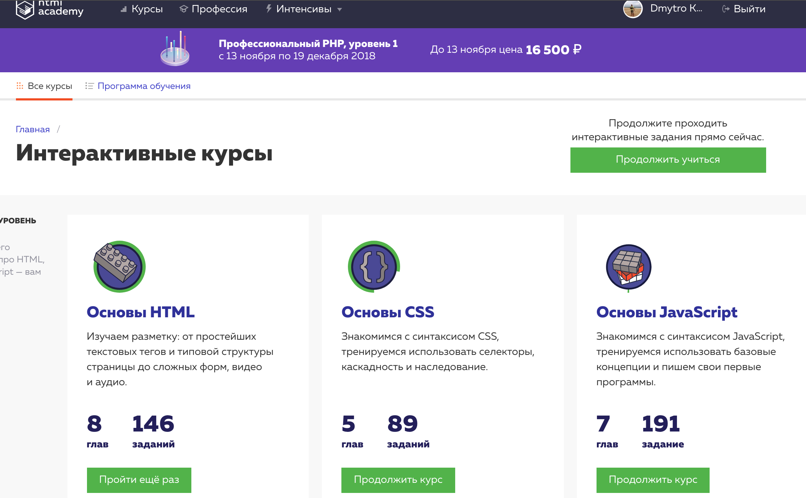

[%3D-Course%20Top--5%20performer-green.svg)](https://github.com/kottans/kottans/blob/master/endorsements.md)
# Kottans frontend course 2019

## General Basics

### Task 0: Git Basics

I liked a lot Udemy git course. Especially materials about pull-request and branching was useful for me.
And, here is my answers to three questions, which was listed in general requirements:

- Materials about about conflicts, branches and merging was new for me.

- I was suprised, that is the thing like staging area exists in git. Also, the thing about octopus was surprising me too.

- I totally will use all the things, that i learned during the course. But right now, i will use knowledge about pull-requests.

### Task 1: Linux CLI, and HTTP

- I liked the practice with the Bash
- I learned a lot about the http protocol
- Right now, I will use 'get' requests to get the content of the pages.

### Task 2: Git Collaboration

- I learned how it`s to make squash.
- I was surprised how easy it is to participate in the open source.
- I will always do git pull before git push.

## Front-End Basics
### Task 3: Intro to HTML and CSS

> It was interesting, well, very easy.

### Task 4: Responsive Web Design

I didn't learn anything new, just remembered about flex and media query.

### Task 5: JS Basics

### Task 6: DOM

> [demo](https://beta-version-profile.github.io/js-dom)
> [code base](https://github.com/kottans/frontend-2019-homeworks/tree/master/submissions/beta-version-profile/js-dom)

Reviewed and approved by @OleksiyRudenko.

## Advanced Topics

### Task 7: A Tiny JS World 

> [demo](https://beta-version-profile.github.io/a-tiny-JS-world)
> [code base](https://github.com/kottans/frontend-2019-homeworks/blob/master/submissions/beta-version-profile/a-tiny-JS-world_/index.js)

Reviewed and approved by @OleksiyRudenko.

## Task 8: Object Oriented JS

## Task 9: OOP exercise
[Demo](http://reminiscent-sail.surge.sh) |
[Code base](https://github.com/beta-version-profile/frontend-2019-homeworks/tree/oop_exercise/submissions/beta-version-profile/oop_exercies)

Reviewed and approved by @AMashoshyna 

## Task 11: Memory – Pair Game
[Demo](http://used-trouble.surge.sh) |
[Code base](https://github.com/beta-version-profile/frontend-2019-homeworks/tree/memory%E2%80%93pair_game/submissions/beta-version-profile/memory-pair_game)
Reviewed and approved by @zonzujiro 

## Task 13: Friends App
[Demo](http://obeisant-love.surge.sh) |
[Code base](https://github.com/beta-version-profile/frontend-2019-homeworks/tree/friends-app/submissions/beta-version-profile/friends_app)

Reviewed and approved by @zonzujiro